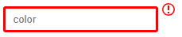
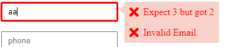
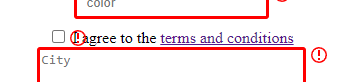
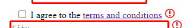

= Angular Feedback Tooltip
FABRE Laurent
v0.1, 08/06/2022: Première version
:toc:
:icons: font

== Version

[horizontal]
Angular:: *13.3*

== Présentation

=== Objectif

L'objectif de ce projet et d'afficher les champs en erreur au moment du focus dans ceux-ci ou de la validation du formulaire.
Pour ce faire, on affiche le contour du champ en rouge avec une icône "!" à côté de celui-ci.

Au focus d'un champ erroné, on affichera un tooltip qui contiendra le ou les messages d'erreur.

À la perte du focus le tooltip disparaitra automatiquement.

Toutes ces informations se mettrons à jour automatiquement lors de la saisie.

== Réalisation

Pour réaliser cet objectif, nous allons utiliser plusieurs directives, ce qui permettra d'intégrer ce code dans des projets en y apportant le moins de modification possible pour que celui-ci soit fonctionnel.

== FormFeedbackDirective

=== Rôle

Cette directive est la plus importante.
C'est elle qui ajoutera l'icône ainsi que le tooltip pour les champs erronés.

=== Selector

Elle a pour selector :

[source,typescript]
----
@Directive({
selector: '[formControl], [formControlName]'
})
----

Grâce à ce selector, on ajoutera cette directive à tous les champs qui auront un formControl ou un formControlName.

Comme :

[source,html]
----
<input type="text" formControlName="name" placeholder="Name">
----

=== Listener

Cette directive a 4 HostListeners

1) Quand le composant gagne le focus

[source,typescript]
----
@HostListener('focusin') addTooltip() {
    this.displayTooltip = true;
    this.focusEvent.next(true);
  }
----

Le but de ce listener est de lancer le traitement (via le next du focusEvent) pour afficher, si besoin, les notifications d'erreur pour le champ.

2) Le composant perd le focus

[source,typescript]
----
 @HostListener('focusout') newColor() {
    this.displayTooltip = false;
    if (this.refTooltip) {
      this.refTooltip.instance.display = false;
    }
  }
----

Le but de se listener est de faire disparaitre le tooltip quand on quitte le champ.

3 - 4) On scroll dans la fenêtre ou on la redimensionne

[source,typescript]
----
@HostListener('window:resize', ['$event'])
@HostListener('window:scroll', ['$event'])
onEvent() {
    if (this.refTooltip) {
      this.refTooltip.instance.onResize(this.element.getBoundingClientRect());
    }
    if (this.refIconNotification) {
      this.refIconNotification.instance.onResize(this.containerParent.element.nativeElement.getBoundingClientRect());
    }
  }
----

Le but de ces listeners est de recalculer la position de l'icône et du tooltip pour qu'ils soient toujours en face de leur champ, si on scroll dans la fenêtre ou si celle-ci est redimensionnée.

=== Observables

Le traitement de la directive se situe dans le *_ngOnInit_*. +
Il se déclenche sous l'action de 3 observables :

[source,typescript]
----
merge(
      this.onSubmit,
      this.controlDir.statusChanges!,
      this.focusEvent
    ).pipe(
      debounceTime(100),
      takeUntil(this.unsubscribeObservables)
    ).subscribe
----

* *_onSubmit_* est un observable de la directive *_FormSubmitDirective_*.
Celle-ci permet de notifier les composants du formulaire à chaque fois que l'utilisateur veut le soumettre.
Ce qui permettra d'indiquer à l'utilisateur s'il y a des champs qui sont incorrects au moment de la validation du formulaire.
* this.controlDir.statusChanges! est un observable sur le contrôleur du formulaire du composant.
Si celui-ci à de nouvelles données, nouvelles saisies etc on relancera le traitement pour adapter l'affichage du tooltip et de l'icône.
Ce qui permet d'adapter les messages d'erreur au fûr et à mesure de la saisie de l'utilisateur.
* this.focusEvent est l'observable notifier lors du focus sur le composant.
Celui-ci répond au besoin d'afficher la tooltip au moment du focus.

_debounceTime(100)_ permet d'attendre un laps de temps (ici 100ms) avant de réexécuter une nouvelle fois le traitement.

=== Récupération des erreurs du formulaire et de leurs messages

On récupère les erreurs du contrôleur grâce au code suivant :

[source,typescript]
----
const controlErrors: ValidationErrors | null = this.control.errors;
if (controlErrors) {
    const lstErrors: string[] = [];
    Object.keys(controlErrors).forEach((errorType) => {
        let text: string | undefined;
        if (this.customErrorMessages?.get(errorType)) {
            text = this.customErrorMessages?.get(errorType);
        } else {
            try {
                text = this.lstErrorMessage[errorType](controlErrors[errorType]);
            } catch (error) {
                lstErrors.push(`This error "${errorType}" is not known in the error list.`);
            }
        }
        if (text) {
            lstErrors.push(text);
        }
    });
    this.element.classList.add('error');
    this.setError(lstErrors);
}
----

On récupère les erreurs du champ (this.control.errors) grâce à son *_AbstractControl_* récupéré dans le constructeur (private controlDir: NgControl).

Une fois que l'on a les erreurs, il faut récupérer le message associer à ce type d'erreur :

* Soit grace aux messages d'erreur personnaliser que l'on peut passer dans la directive grâce à un Input

Code dans la directive :

[source,typescript]
----
@Input() customErrorMessages: Map<string, string> | undefined;
----

Code html pour donner la map :

[source,html]
----
<input type="text" formControlName="color" placeholder="color" [customErrorMessages]="this.customErrorsColor"
placementTooltip="top">
----

Exemple d'instantiation de map :

[source,typescript]
----
customErrors: Map<string, string> = new Map<string, string>([
["required", "Please accept the terms"]
]);
customErrorsColor: Map<string, string> = new Map<string, string>([
["wrongColor", "The color should be blue"]
]);
----

Nous retrouvons en clé le type de l'erreur et en valeur son message.

* Sinon, si nous n'avons pas de message personnalisé pour cette erreur, alors nous regardons dans les messages génériques.
Ceux-ci sont déclarés dans le fichier *_error-messages_*.

[source,typescript]
----
export const defaultErrors = {
  required: () => `This field is required`,
  minlength: ({
                requiredLength,
                actualLength
              }: { requiredLength: number, actualLength: number }) => `Expect ${requiredLength} but got ${actualLength}`,
  maxlength: ({
                requiredLength,
                actualLength
              }: { requiredLength: number, actualLength: number }) => `Expect ${requiredLength} but got ${actualLength}`,
  pattern: ({requiredPattern}: { requiredPattern: string }) => `This field does not respect the pattern : \n ${requiredPattern}.`,
  email: () => `Invalid Email.`
}
----

Nous retrouvons ici les différentes erreurs communes.
Pour chaque erreur, nous retrouvons un message qui peut prendre en compte les paramètres fourni par l'erreur, comme la taille requise pour un champ.

Nous les injectons ensuite dans un Token qui à pour nom "FROM_ERRORS"_.

[source,typescript]
----
export const ERROR_MESSAGES = new InjectionToken('FORM_ERRORS', {
  providedIn: 'root',
  factory: () => defaultErrors
});
----

Nous récupérons ensuite les messages grâce à l'injection du token dans le constructeur de la directive.

[source,typescript]
----
@Inject(ERROR_MESSAGES) private lstErrorMessage: any
----

* Si l'erreur n'a pas de message renseigné alors on affichera un message générique pour le signaler :

[source,typescript]
----
 lstErrors.push(`This error "${errorType}" is not known in the error list.`);
----

Une fois tous les messages récupérés dans un tableau,

[source,typescript]
----
if (text) {
    lstErrors.push(text);
}
----

On les donnera à l'instance du tooltip pour qu'il les affiche.

[source,typescript]
----
this.refTooltip.instance.lstErrorMessage = lstErrorMessage;
----

=== Ajout du style erreur

Pour montrer visuellement les champs erronés à l'utilisateur, nous avons rajouté un contour rouge.
Pour ce faire nous rajoutons une classe *_"error"_*.

Nous allons donc récupérer l'élément Ref dans le constructeur

[source,typescript]
----
private host: ElementRef<HTMLFormElement>
----

Puis on va récupérer le nativeElement de celui-ci,

[source,typescript]
----
get element() {
    return this.host.nativeElement;
}
----

Pour récupérer la liste des classes et ajouter celle que l'on désire.

[source,typescript]
----
this.element.classList.add('error');
----

[source,scss]
----
.error {
  border: 3px solid red;
  border-radius: 3px;

  &:focus-visible {
    outline: none;
  }
}
----

Puis, s'il n'y a plus d'erreur, il suffit de la supprimer de la liste.

[source,typescript]
----
this.element.classList.remove('error');
----

=== setError

Cette méthode permet d'afficher la tooltip avec les messages d'erreurs et l'icône de notification ou de tout supprimer du DOM s'il n'y a plus de message d'erreur.

==== Suppression du DOM

S'il n'y a aucun message d'erreur, on "nettoie" le composant parent qui contient la tooltip et l'icône de notification grace au _clear()_, puis on supprime les références de ceux-ci grâce au _delete_.

[source,typescript]
----
if (!lstErrorMessage || lstErrorMessage.length <= 0) {
      this.containerParent.clear();
      delete this.refTooltip;
      delete this.refIconNotification;
    }
----

==== Affichage des composant avec les messages d'erreurs

[source,typescript]
----
// Tooltip
if (!this.submitEvent) {
    if (!this.refTooltip) {
        this.refTooltip = this.containerParent.createComponent(TooltipErrorComponent);
    }
    this.refTooltip!.instance.display = this.displayTooltip
    this.refTooltip.instance.positionParent = this.element.getBoundingClientRect();
    this.refTooltip.instance.placementTooltip = this.placementTooltip;
    this.refTooltip.instance.lstErrorMessage = lstErrorMessage;
}
// Icon
const controlName = this.host.nativeElement.attributes.getNamedItem('formcontrolname')!.value;
const id = `icon-notif-${controlName}`;
if (!document.getElementById(id)) {
    this.refIconNotification = this.containerParent.createComponent(IconNotificationComponent);
    this.refIconNotification.instance.id = id;
}
if (this.refIconNotification) {
    this.refIconNotification.instance.positionParent = this.containerParent.element.nativeElement.getBoundingClientRect();
    this.refIconNotification.instance.placementIconNotification = this.placementIconNotification;
}
----

Dans cette méthode, on crée les composants (Tooltip + icône) en utilisant la méthode *_createComponent_* de *_ViewContainerRef_* du composant parent récupéré dans le constructeur.

Une fois les composants créés, on récupère leurs instances pour pouvoir leur transmettre des valeurs comme la position du parent, la liste des erreurs à afficher etc ....

Pour l'icône, on rajoute un contrôle pour pas afficher deux icônes pour un même controlName.
(Dans l'exemple ce test est utile pour les radios boutons).

==== Supprimer les composants s'il n'y a plus de message d'erreur

[source,typescript]
----
 if (!lstErrorMessage || lstErrorMessage.length <= 0) {
      this.containerParent.clear();
      delete this.refTooltip;
      delete this.refIconNotification;
    }
----

Si nous n'avons pas ou plus de messages d'erreur, alors nous devons supprimer le tooltip et l'icone du parent.
Pour ce faire nous allons les supprimers du DOM grâce à la commande suivante :

[source,typescript]
----
 this.containerParent.clear();
----

Puis nous supprimerons les références sur les objets grace au *_delete_*.
(Ils seront donc nettoyés par la suite par le GC, car ils n'auront plus aucunes références dessus.)

[source,typescript]
----
delete this.refTooltip;
delete this.refIconNotification;
----

== FormSubmitDirective

=== Rôle

Cette directive est utilisée pour savoir quand on soumet le formulaire.

=== Selector

Pour ce faire, elle a le selector "form" :

[source,typescript]
----
@Directive({
  selector: 'form'
})
----

Grâce à ce selector tous les formulaires auront automatiquement cette directive.

Comme :

[source,html]
----
<form *ngIf="this.form" [formGroup]="this.form">
----

=== Fonctionnement

Pour récupérer l'évènement _'submit'_ du formulaire, on va récupérer l'élément via le constructeur et on va utiliser la fonction

[source,typescript]
----
submit$ = fromEvent(this.element, 'submit');
----

Nous avons maintenant un observable qui se nomme _"submit$"_ et qui sera notifié à chaque submit du formulaire. +
On utilisera cet observable dans la directive précédente (voir <<Observables>>) pour exécuter le traitement à chaque notification de celui-ci.

[source,typescript]
----
this.onSubmit = this.formSubmitDirective ? this.formSubmitDirective.submit$.pipe(tap(() => this.submitEvent = true)) : EMPTY;
----

== ControlErrorContainerDirective

=== Rôle

Cette directive est utilisée pour afficher l'icône et la tooltip un cran plus haut que sur le composant qui à la directive <<FormFeedbackDirective>>. +
Dans certains cas, il peut être intéressant de ne pas afficher l'icône et la tooltip directement après le composant qui contient le _'formControl'_ ou le _'formControlName'_. +
Comme dans le cas d'une checkbox.

Sans la directive :

Avec la directive :

Utilisation :

[source,html]
----
 

    <label class="checkbox">
        <input type="checkbox" formControlName="terms" [customErrorMessages]="this.customErrors">
          I agree to the <a href="#">terms and conditions</a>
    </label>

----

=== Selector

[source,typescript]
----
@Directive({
  selector: '[appControlErrorContainer]'
})
----

== Icon-notification

Icon-notification est le composant qui va afficher le *_"!"_* rouge.

=== HTML

La partie HTML de se composant et relativement simple

[source,html]
----

    <svg-icon [id]="this.id" class="icon-notification" icon="icon-notification"></svg-icon>

----

Nous utilisons ici le composant *_svg-icon_* présenté dans un autre projet (https://github.com/Laurent-Fabre/angular-sprite-svg[ici]), pour afficher l'icône récupérée sur https://icomoon.io/app/#/select[icomoon].

=== TS

La partie typescript est assez simple aussi.
En dehors des différents @Input() que la directive *_FormFeedbackDirective_* utilise pour donner des informations.
La méthode la plus complexe est :

[source,typescript]
----
private calculatePositionIcon() {
    if (this._positionParent && this.iconElementRef) {
      let value: number = window.scrollY;
      switch (this._placementIconNotification) {
        case 'top': {
          value += this._positionParent.top - this.iconElementRef.nativeElement.offsetHeight;
          break;
        }
        case 'bottom': {
          value += this._positionParent.bottom + this.iconElementRef.nativeElement.offsetHeight;
          break;
        }
        case 'left': {
          this.renderer.setStyle(this.iconElementRef.nativeElement, 'left', `${this._positionParent.left - this.iconElementRef.nativeElement.offsetWidth - 5}px`);
          value += this._positionParent.top;
          break;
        }
        default: {
          this.renderer.setStyle(this.iconElementRef.nativeElement, 'left', `${this._positionParent.right + 5}px`);
          value += this._positionParent.top;
          break;
        }
      }
      this.renderer.setStyle(this.iconElementRef.nativeElement, 'top', `${value}px`);
    }
  }
----

Celle-ci permet de positionner correctement l'icône selon la position du composant parent et selon le placement désiré (top, bottom, left ou celle par défaut right).

On fournis cette information grâce à l'input *_placementIconNotification_*.

[source,html]
----
<input type="text" formControlName="name" placeholder="Name" placementIconNotification="top">
----

== Tooltip-error

=== HTML

[source,html]
----

 0" #tooltip class="tooltip">
  

    <svg-icon icon="icon-cross"></svg-icon>
    {{error}}
  

----

Nous affichons le tooltip uniquement si le boolean display et sur true et si il y a au moins une erreur. +
Puis nous avons une boucle sur la liste des erreurs pour afficher leurs messages. +
Pour chaque message nous affichons une croix en icône grâce au composant *_svg-icon_* présenté https://github.com/Laurent-Fabre/angular-sprite-svg[ici].

=== TS

La partie TS se rapproche du composant *_icon-notification_*.
Nous retrouvons divers "@Input()" pour que la directive *_FormFeedbackDirective_* donne les informations au composant comme les messages d'erreur ou encore la position du parent.

La méthode la plus importante est calculatePositionTooltip

[source,typescript]
----
  private calculatePositionTooltip() {
    if (this._positionParent && this.tooltip) {
      this.cleanCSS();
      switch (this._placementTooltip) {
        case 'top': {
          if (!this.setPositionTop()) {
            this.automaticPlacement();
          }
          break;
        }
        case 'bottom': {
          if (!this.setPositionBottom()) {
            this.automaticPlacement();
          }
          break;
        }
        case 'left': {
          if (!this.setPositionLeft()) {
            this.automaticPlacement();
          }
          break;
        }
        default: {
          this.automaticPlacement();
          return;
        }
      }
    }
  }
----

Elle permet de savoir où afficher le composant selon la position du parent et le paramètre "*__placementTooltip_*" transmit par l'utilisateur.

[source,html]
----
<input type="text" formControlName="color" placeholder="color" [customErrorMessages]="this.customErrorsColor" placementTooltip="top">
----

Si aucune position est donnée on l'affichera par défaut à droite.

Pour tous les positionnements si l'écran n'est pas assez grand pour afficher le composant alors on l'affiche à un autre endroit.
L'ordre est le suivant :

. S'il y a de la place, on affiche le composant à *_droite_*.
. Sinon, s'il y a de la place, on affiche le composant en *_bas_*.
. Sinon, s'il y a de la place, on affiche le composant en *_haut_*.
. Et si aucune des précédentes positions sont possibles, on l'affiche à *_gauche_* même s'il n'y a pas assez de place.

Grâce à la méthode suivante :

[source,typescript]
----
  private automaticPlacement() {
    if (this._positionParent && this.tooltip) {
      // Position de la scroll bar vertical.
      let value: number = window.scrollY;
      //window.innerWidth taille de l'écran en largeur
      if (window.innerWidth - this._positionParent.right > (this.tooltip.nativeElement.offsetWidth + 10)) {
        this.renderer.setStyle(this.tooltip.nativeElement, 'left', `${this._positionParent.right + 10}px`);
        value += this._positionParent.top;
        this.renderer.addClass(this.tooltip.nativeElement, 'right');
      } else if (window.innerHeight - this._positionParent.bottom > (this.tooltip.nativeElement.offsetHeight + 10)) {
        value += this._positionParent.bottom + 10;
        this.renderer.addClass(this.tooltip.nativeElement, 'bottom');
      } else if (this._positionParent.top - (this.tooltip.nativeElement.offsetHeight + 10) > 0) {
        value += this._positionParent.top - this.tooltip.nativeElement.offsetHeight - 10;
        this.renderer.addClass(this.tooltip.nativeElement, 'top');
      } else {
        this.renderer.setStyle(this.tooltip.nativeElement, 'left', `${this._positionParent.left - this.tooltip.nativeElement.offsetWidth - 10}px`);
        value += this._positionParent.top;
        this.renderer.addClass(this.tooltip.nativeElement, 'left');
      }
      this.renderer.setStyle(this.tooltip.nativeElement, 'top', `${value}px`);
    }
  }
----

== Conclusion

Nous arrivons à la fin de la présentation. +
Le but de ce projet est donc d'avoir un composant le plus paramétrable possible pour qu'il puisse réponde à toutes les exigences. +

N’hésitez pas à me contacter pour toutes remarques ou propositions d’évolution. +
Bon dev à tous !
